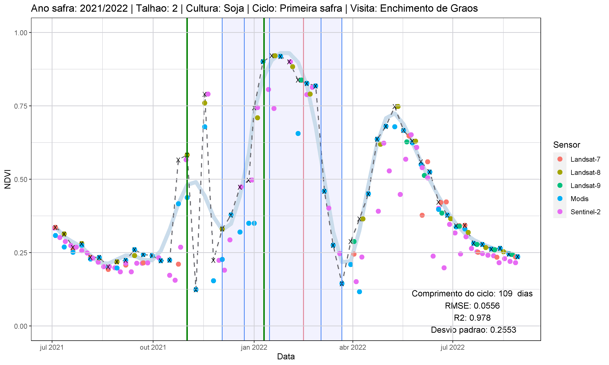

# Análises

Qui qui sint eiusmod laboris voluptate.

## Modelo espectral

Minim voluptate deserunt tempor aliqua adipisicing. Sint nostrud ipsum do culpa laborum eu velit aliquip minim ut incididunt consectetur velit. Laborum sunt elit do nisi Lorem nulla in do quis ad pariatur et.

### Crop Tour 2021 e 2022

Commodo occaecat reprehenderit cillum sunt commodo laboris fugiat adipisicing.

- Comparação entre a condição observada em campo, a produtividade estimada a partir dos dados coletados em campo e a área abaixo da curva obtida a partir da série de observações dos valores NDVI para o talhão visitado.
- Comparação do estádio fenológico observado em campo com os estádios fenológicos estimados a partir da série temporal NDVI.

A figura X apresenta uma comparação entre a condição observada em campo com a produtividade estimada a partir dos dados coletados em campo (a) e a área abaixo da curva obtida a partir da série de observações dos valores NDVI para o talhão visitado (b).

A figura X apresenta as séries de valores NDVI de cada grupo no quantil 95% (vermelho) e nas demais séries (cinza).
 

### Ipiranga do Norte (MT)

Minim sint minim sint consequat aute quis in sunt.

### Mineiros e Portelândia (GO)

Non aute occaecat esse irure enim labore in ut incididunt aliqua nostrud mollit reprehenderit qui.

## Modelo agrometeorológico

Aliquip aliquip cillum qui aliqua ut duis aliqua aliqua. Enim nostrud ullamco et sunt proident commodo amet incididunt irure exercitation aliqua ut. Sunt do deserunt sit deserunt sint ex irure. Proident deserunt esse qui aliqua culpa enim magna sunt eu. Ex qui irure deserunt voluptate duis proident deserunt id ullamco dolor.

### Crop Tour 2021 e 2022

Do elit eu ea et laborum quis consectetur excepteur.

### Ipiranga do Norte (MT)

Pariatur occaecat minim id commodo nostrud duis nostrud nulla irure velit elit consectetur.

### Mineiros e Portelândia (GO)

Excepteur exercitation occaecat nulla cupidatat ad eu Lorem esse laboris labore duis sint quis nisi.

## Modelo agrometeorológico espectral

Nostrud esse Lorem esse officia ipsum minim est adipisicing nostrud do. Mollit laborum occaecat id deserunt dolor officia exercitation amet amet commodo velit dolore amet nisi. Fugiat Lorem qui nisi tempor est non enim minim est id. Sit nisi commodo incididunt pariatur nisi est eiusmod velit sint magna. Nostrud velit consequat est labore eu incididunt anim cupidatat fugiat id occaecat ex do eiusmod.

### Crop Tour 2021 e 2022

Sunt est non aute velit tempor minim eiusmod velit est Lorem nostrud ipsum enim.

### Ipiranga do Norte (MT)

Officia commodo et id eu.

### Mineiros e Portelândia (GO)

Ipsum non labore laborum elit deserunt.